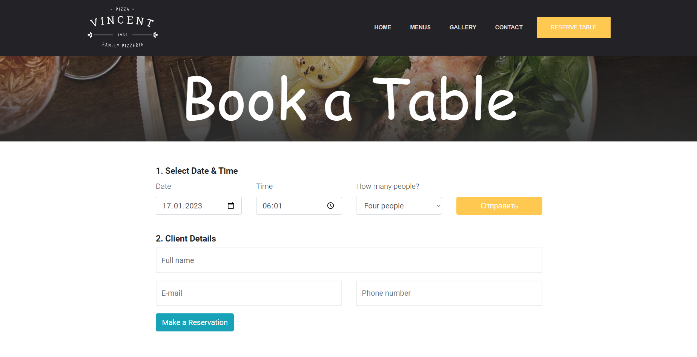

# [Курсовая работа](http://r92293n8.beget.tech/index.php)

## Цель работы:
В качестве цели работы было выбрано создание сайта некоего выдуманного ресторана Vincent Pizza в городе Корпус-Кристи, штат Техас. Сайт сделан полностью на английском языке в целях корректного отображения шрифтов и, конечно, аутентичности.

## Описание проекта
**Функционал сайта:**
- наглядное меню с ценами, фото и описаниями блюд
- бронирование столиков
- заказ доставки еды на дом
- возможность связаться с рестораном (телефон/почта)
- админ-панель


Для публикации сайта во всемирную сеть была выбрана бесплатная версия хостинга [Beget](https://beget.com/ru/hosting/free). Домен тоже предоставлялся бесплатно, красивым его не назвать, но какой есть.

## Пользовательский интерфейс (главная страница)

Главная страница подразделяется на несколько частей для удобства пользования. В дальнейшем разделы буду называть в соответствии с разделами на панели навигации:

### 1. Home

Чисто приветственная часть сайта, пользователь видит ее как только попадает на страницу. Тут находятся все нужные кнопки и ссылки, кроме формы обратной связи и карты.

### 2. Menus

Эта часть отображает настоящее меню ресторана, разделенное по категориям блюд. У каждого блюда есть фото, название, описание и цена в долларах США.

### 3. Gallery

Здесь должны находиться фотографии кухни, блюд, зала и т. д.

### 4. Contact

Тут можно найти контактные данные, если вдруг необходимо связаться с рестораном, и форму обратной связи.

Также имеется встроенная карта от Яндекс.Карт:

В идеале хотелось бы использовать API Google.Maps, но Гугл больше не выдает API-ключи пользователям из РФ.


## Пользовательский интерфейс (страница бронирования)

Если нажать на кнопку **RESERVE TABLE** на панели навигации, то появится отдельная страница, где можно забронировать столик:


После выбора даты и количества гостей, необходимо заполнить информацию о себе:


Нажатие на кнопку **Make a Reservation** вызовет отправку данных в БД и проверку на наличие свободных столиков.


## Пользовательский интерфейс (страница заказа доставки)

Если нажать на кнопку **RESERVE TABLE** на главной странице, то появится отдельная страница, где можно заказать доставку на дом.
Процесс заказа доставки состоит из 2 частей:
1. Выбор блюд:

2. Информация о себе

   
После подтверждения заказа информация уходит в БД, а оттуда на админ-панель.


## Админ-панель
Так выглядит админ-панель:


Здесь находится вся информация о сайте, его посетителях и админах. Отсюда можно редактировать содержание сайта, управлять заказами и т. п.


## Структура базы данных


База данных управляется через phpMyAdmin и состоит из нескольких таблиц:
- **clients** - содержит записи о клиентах ресторана
- **image_gallery** - содержит названия картинок и имена файлов, отображающихся в разделе **Gallery** на главной странице
- **in_order** - содержит записи о блюдах в заказах на доставку
- **menus** - содержит все блюда в меню ресторана
- **menu_categories** - содержит категории меню
- **placed_orders** - содержит записи о заказах на доставку
- **reservations** - содержит информацию о бронировании
- **tables** - отображает количество столиков в ресторане
- **users** - содержит записи о пользователях с доступом к админ-панели
- **website_settings** - содержит контактные данные ресторана, отображающиеся в разделе **Contact** на главной странице


## Значимые фрагменты кода

#### API Яндекс.Карт
```javascript
<script src="https://api-maps.yandex.ru/3.0/?apikey=6d67ea60-ec75-4761-a171-df817498784e&load=package.full&lang=ru_RU"></script>
<script>
  ymaps3.ready.then(() => {
    const map = new ymaps3.YMap(document.getElementById('YMapsID'), {
      location: {
        center: [27.738086, -97.404386],
        zoom: 7
      }
    });
  });
</script>
    ... ...
<div id="YMapsID" style="width: 100%; height: 400px;"></div>
```

#### Отправка формы обратной связи
```javascript
$.ajax({
    url: "Includes/php-files-ajax/contact.php",
    type: "POST",
    data:{contact_name:contact_name, contact_email:contact_email, contact_subject:contact_subject, contact_message:contact_message},
    success: function (data) 
    {
        $('#contact_status_message').html(data);
    },
    beforeSend: function()
    {
        $('#sending_load').show();
    },
    complete: function()
    {
        $('#sending_load').hide();
    },
    error: function(xhr, status, error) 
    {
        alert("Internal ERROR has occured, please, try later!");
    }
    });
```

#### Проверка доступности столиков для бронирования
```php
if(isset($_POST['check_availability_submit']))
{
    $selected_date = $_POST['reservation_date'];
    $selected_time = $_POST['reservation_time'];
    $number_of_guests = $_POST['number_of_guests'];

    $stmt = $con->prepare("SELECT table_id FROM tables WHERE table_id NOT IN 
        (SELECT t.table_id FROM tables t, reservations r WHERE 
        t.table_id = r.table_id
        AND DATE(r.selected_time) = ?
        AND liberated = 0
        AND canceled = 0)
    ");

    $stmt->execute(array($selected_date));
    $rows = $stmt->fetch();
... ...
```